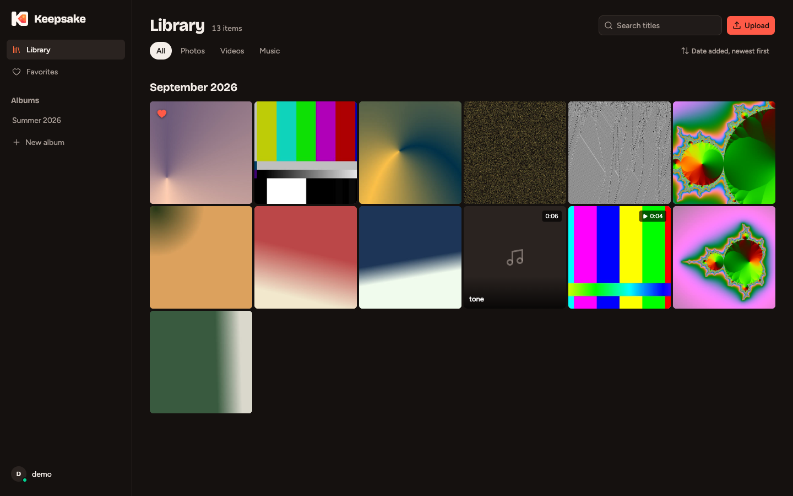
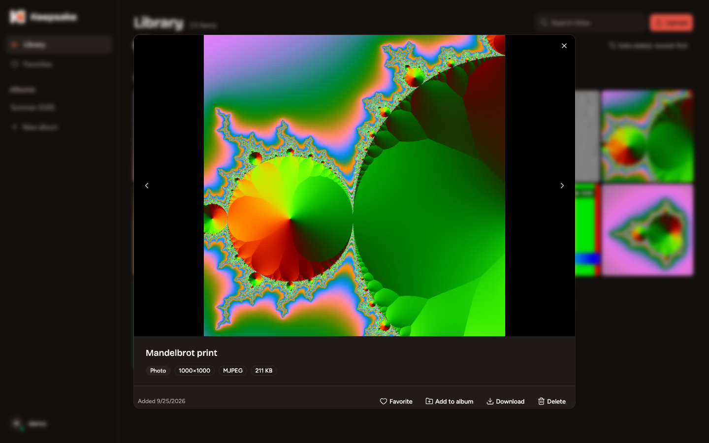
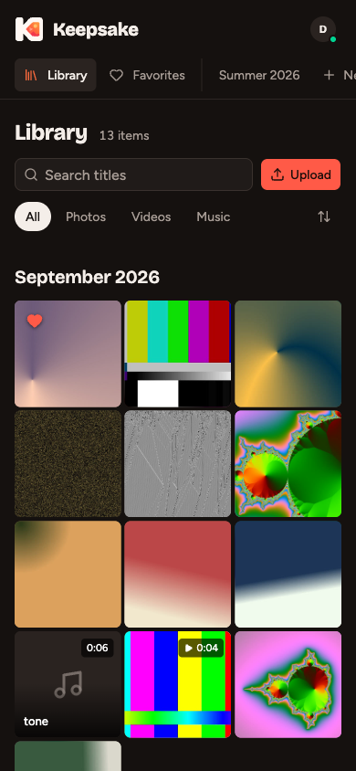

<p align="center">
  
</p>

<h1 align="center">Keepsake</h1>

<p align="center">
  A home for your photos, music and videos. Hosted by you.
</p>

<p align="center">
  <a href="https://github.com/bilalyazicioglu/keepsake/actions/workflows/ci.yml"></a>
  <a href="LICENSE"></a>
  <a href="go.mod"></a>
  <a href="https://github.com/bilalyazicioglu/keepsake/issues?q=is%3Aissue+is%3Aopen+label%3A%22good+first+issue%22"></a>
</p>

<p align="center">
  
</p>

Keepsake is a personal media library with a Go backend and a React interface. Upload your files, organize them into albums, and browse or play them from any browser on your network.

> [!WARNING]
> Keepsake is in early development. The API and deployment setup will change, and there is no migration guarantee between versions yet. Keep a separate backup of your original files.

## Features

- **Resumable uploads.** Large files upload in 8 MiB parts. An interrupted upload continues from the last part the server received.
- **Streaming video.** Videos are transcoded to adaptive HLS renditions with FFmpeg, using VideoToolbox on macOS when available.
- **Previews that load instantly.** Thumbnails and BlurHash placeholders are generated for photos, videos and embedded audio cover art.
- **Live progress.** Processing stages and percentages arrive over a WebSocket while you keep browsing.
- **Organization.** Albums, favorites, title search, filters by type, and sorting by upload date, capture date or name.
- **Your data stays put.** Originals are stored untouched on your disk, with paths relative to one storage root you can move.

<table>
  <tr>
    <td width="68%"></td>
    <td></td>
  </tr>
</table>

## Quick start

You need Docker with Compose, and OpenSSL to generate a secret.

```sh
git clone https://github.com/bilalyazicioglu/keepsake.git
cd keepsake
cp .env.example .env
openssl rand -hex 32   # paste the output as JWT_SECRET in .env
docker compose up --build -d
```

Open **http://localhost:8080**, create an account, and upload a file.

Keep `JWT_SECRET` the same across restarts, or everyone is signed out. The `pgdata` volume holds the database and `mediadata` holds your media. Don't remove them when updating, and back up both: [docs/backup.md](docs/backup.md) has tested commands.

> [!IMPORTANT]
> The Compose file is a development setup. It publishes ports 8080 and 5432 and uses development database credentials. Change the credentials, stop publishing the database port, and put Keepsake behind TLS before exposing it outside your machine.

The project was previously named outofmatrix. Compose keeps `outofmatrix` as its project name so existing volume names don't change.

## Configuration

Keepsake reads its settings from environment variables. Startup fails with a message naming the variable if a value can't be parsed.

| Variable | Default | Purpose |
|---|---|---|
| `JWT_SECRET` | random per start | Signs session tokens. Set it, or sessions end on every restart. |
| `TOKEN_TTL` | `72h` | How long a sign-in lasts. |
| `STORAGE_PATH` | `./data/media` | Where originals, thumbnails and HLS output are stored. |
| `DATABASE_URL` | local development database | PostgreSQL connection string. |
| `MAX_UPLOAD_BYTES` | `10737418240` (10 GiB) | Largest accepted file. |
| `MAX_WORKERS` | half the CPU cores | Files processed at the same time. |
| `PROCESS_TIMEOUT` | `45m` | Longest a single file may take to process. |
| `HWACCEL` | `auto` | H.264 encoder: `auto`, `videotoolbox` or `none`. |
| `UPLOAD_TTL` | `48h` | When abandoned uploads are cleaned up. |

The full list, including the API routes, is in [docs/reference.md](docs/reference.md).

## Development

You need Go (version in [`go.mod`](go.mod)), Node 22, PostgreSQL and FFmpeg with ffprobe.

```sh
make db-up      # PostgreSQL in Docker
make web        # build the interface into static/
make run        # build and start the server on :8080
```

For interface work, run `make web-dev` in a second terminal. The Vite server on :5173 reloads on save and forwards API calls to the Go server.

Before opening a pull request, run the same checks as CI:

```sh
gofmt -l . && go vet ./... && go test ./...
cd web && npm run lint && npm run build
```

## How it fits together

```text
Browser ──HTTP/WebSocket──▶ Go server ──▶ PostgreSQL
                               │
                               ▼
                         media storage ◀── FFmpeg workers
                                           (thumbnails, HLS)
```

The Go server serves the built interface, the API and media files. PostgreSQL and FFmpeg are runtime dependencies.

| Path | Responsibility |
|---|---|
| `cmd/server` | Startup, wiring and shutdown |
| `internal/domain` | Models and repository interfaces |
| `internal/usecase` | Upload, processing, library and auth logic |
| `internal/repository/postgres` | PostgreSQL adapters and migrations |
| `internal/delivery/http` | HTTP handlers and middleware |
| `internal/delivery/ws` | WebSocket hub for processing events |
| `internal/worker` | Background job pool |
| `pkg/ffmpeg` | FFmpeg and ffprobe integration |
| `web` | React interface |

## Roadmap

Planned work is tracked in [issues](https://github.com/bilalyazicioglu/keepsake/issues). Current priorities:

- A reliable first-run path with Docker ([#2](https://github.com/bilalyazicioglu/keepsake/issues/2))
- Upload and processing correctness under failure ([#7](https://github.com/bilalyazicioglu/keepsake/issues/7), [#8](https://github.com/bilalyazicioglu/keepsake/issues/8), [#9](https://github.com/bilalyazicioglu/keepsake/issues/9), [#10](https://github.com/bilalyazicioglu/keepsake/issues/10))
- Playback links that don't carry the full session token ([#14](https://github.com/bilalyazicioglu/keepsake/issues/14))
- Storage limits per user ([#1](https://github.com/bilalyazicioglu/keepsake/issues/1))

## Contributing

Bug reports, focused fixes and documentation improvements are welcome. For larger changes, open a proposal first so we can agree on scope. Read [CONTRIBUTING.md](CONTRIBUTING.md) to get started, and look for issues labelled [good first issue](https://github.com/bilalyazicioglu/keepsake/issues?q=is%3Aissue+is%3Aopen+label%3A%22good+first+issue%22).

Please follow the [code of conduct](CODE_OF_CONDUCT.md). To report a vulnerability, see [SECURITY.md](SECURITY.md) instead of opening a public issue.

## License

Keepsake is free software under the [GNU Affero General Public License v3.0](LICENSE). If you run a modified version as a network service, you must offer its source code to that service's users.
